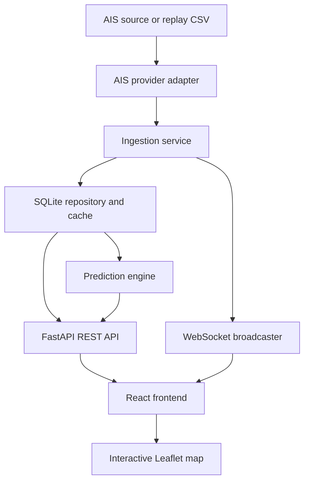

# AIS Trajectory Predictor

A lightweight containerized AIS vessel tracking and trajectory prediction system for public, civilian AIS research and education.

The first version runs completely offline with replayed sample AIS data. Start it with Docker Compose, open the frontend, and vessels immediately move on an interactive map. The frontend never calls external AIS services directly.

## Architecture



## Technology Choices

- Frontend: React, Vite, TypeScript, Leaflet, responsive dashboard UI.
- Backend: Python, FastAPI, Pydantic schemas, async ingestion, REST, WebSocket.
- Storage: SQLite through a repository abstraction so PostgreSQL/PostGIS can replace it later.
- Prediction: baseline constant-velocity trajectory predictor using speed over ground and course over ground.
- Data source: `ReplayAISProvider` by default, with an optional conservative public HTTP API adapter.
- Containers: separate frontend and backend containers orchestrated by Docker Compose.

## Data Flow

1. `ReplayAISProvider` reads `data/sample/replay_ais.csv`.
2. The ingestion service validates and normalizes each AIS position.
3. SQLite stores recent vessel positions and maintains the latest position per vessel.
4. WebSocket clients receive live vessel updates.
5. REST endpoints provide vessel lists, vessel details, history, predictions, and system status.
6. The React dashboard updates markers, route lines, and the selected vessel panel.

## Prediction Strategy

The initial model is intentionally simple and reliable. For a selected vessel, the backend reads recent history, resolves speed and course from AIS fields or recent motion, then projects future points at configurable time steps. The prediction layer depends on a `GeographicValidator` interface, keeping coastline checks, land masks, route corridors, and ML-based correction separate from the model.

## Quick Start

```bash
docker compose up --build
```

Open:

- Frontend: `http://localhost:5173`
- Backend API docs: `http://localhost:8000/docs`
- Backend health: `http://localhost:8000/api/health`

No external AIS API key is required for the default replay demo.

## Local Development

Backend:

```bash
cd backend
python -m venv .venv
source .venv/bin/activate
pip install -r requirements.txt
uvicorn app.main:app --reload
```

Frontend:

```bash
cd frontend
npm install
npm run dev
```

The Vite development server proxies `/api` and `/ws` to the backend.

## Configuration

Copy `.env.example` to `.env` if you want to override defaults.

Important variables:

| Variable | Purpose |
| --- | --- |
| `AIS_PROVIDER` | `replay` or `public_api`. |
| `AIS_API_URL` | Public AIS HTTP endpoint for the optional adapter. |
| `AIS_API_KEY` | Optional upstream API key. Never commit real keys. |
| `AIS_POLL_INTERVAL` | Minimum polling interval for HTTP providers. |
| `DATABASE_URL` | SQLite database URL. |
| `REPLAY_DATA_PATH` | Replay CSV path. |
| `REPLAY_SPEED_MULTIPLIER` | Replay acceleration factor. |
| `PREDICTION_HORIZON_SECONDS` | Future prediction horizon. |
| `PREDICTION_STEP_SECONDS` | Seconds between predicted points. |
| `HISTORY_WINDOW_MINUTES` | Recent trajectory retention window. |

## API Endpoints

- `GET /api/health`
- `GET /api/vessels`
- `GET /api/vessels/{mmsi}`
- `GET /api/vessels/{mmsi}/history`
- `GET /api/vessels/{mmsi}/prediction`
- `GET /api/system/status`
- `WS /ws/vessels`

FastAPI automatically publishes full OpenAPI documentation at `/docs`.

## Frontend Features

- Interactive maritime map.
- Rotated vessel markers based on heading or course.
- Live WebSocket marker updates.
- Vessel search by MMSI or name.
- Clickable vessel markers and vessel list rows.
- Selected vessel highlighting.
- Vessel information panel.
- Solid historical trajectory line.
- Dashed predicted trajectory line.
- Map legend, connection status, and system status.
- Auto-follow mode for the selected vessel.

## AIS Data Provider Design

AIS sources are implemented behind an adapter interface:

- `ReplayAISProvider`: deterministic CSV replay for demos and tests.
- `PublicAPIProvider`: optional conservative HTTP polling adapter with interval control, deduplication, rate-limit handling, exponential backoff, and no direct frontend access.

Future adapters can support public WebSocket feeds or MQTT without changing the API or frontend.

## Legal and Privacy Scope

This project is for civilian public AIS education and research only. It must only process publicly and lawfully available AIS data. Do not use military, classified, restricted, private, or unauthorized vessel tracking data. Do not bypass authentication, scraping protections, or rate limits.

## Project Structure

```text
backend/
  app/
    api/
    core/
    geographic/
    ingestion/
    models/
    prediction/
    providers/
    schemas/
    services/
    websocket/
  tests/
frontend/
  src/
    components/
    hooks/
data/
  sample/
docs/
docker-compose.yml
.env.example
README.md
```

## Tests

```bash
cd backend
pytest
```

Current backend tests cover validation, SQLite deduplication, the health endpoint, and baseline prediction behavior.

## Limitations

- Replay mode uses sample civilian AIS-like data and is intended for local demonstration.
- The first predictor is a baseline short-term model, not a trained ML model.
- The first geographic validator checks coordinate validity only. Coastline and land-intersection correction are intentionally separated for a later iteration.
- The optional public API adapter must be specialized for the exact schema and legal terms of the selected AIS provider before production use.

## Future Improvements

- Add a coastline or land-mask validator.
- Add PostgreSQL/PostGIS repository implementation.
- Add public AIS WebSocket or MQTT provider adapters.
- Add model evaluation notebooks and a lightweight ML predictor.
- Add route corridor correction using historical public AIS tracks.
- Add marker clustering for high-density vessel traffic.
